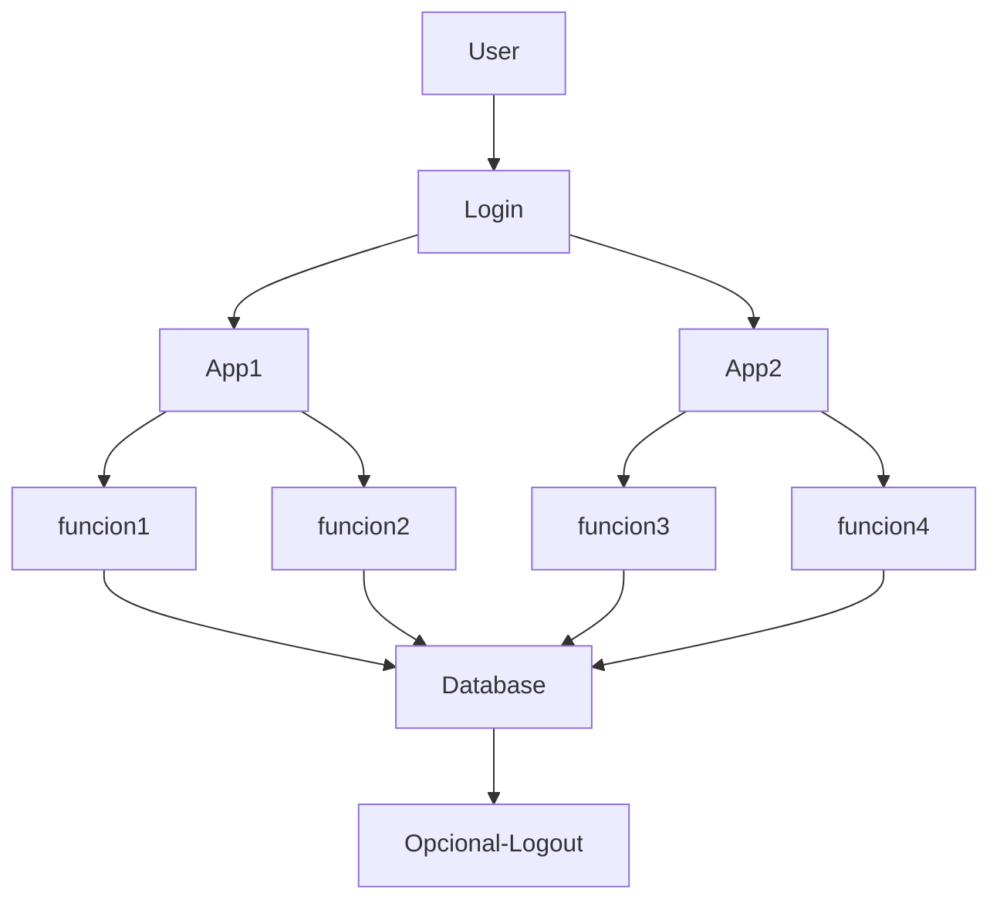

# **CEFAEMPRESA -- ERP**

Este documento presenta la introducción al proyecto **CEFAEMPRESA-ERP**,
un sistema de tipo **ERP (Enterprise Resource Planning)** cuyo propósito
es optimizar y centralizar la gestión de información empresarial. A
continuación se explica el porqué de su creación y la forma en que está
estructurado.

El proyecto nace con el objetivo de solucionar diversas problemáticas
administrativas relacionadas con la gestión y consolidación de
información. Actualmente, los datos se administran mediante herramientas
dispersas como **Google Drive, Wix, Excel y documentos físicos**, lo
cual dificulta la organización, el acceso oportuno a la información y el
trabajo colaborativo.

Para resolver estos inconvenientes, el ERP proporciona a cada usuario
una plataforma con **credenciales propias**, lo que les permite
interactuar con el sistema de forma segura y acceder a información
**persistente y centralizada**.

El software se compone de un conjunto de **aplicaciones internas**, cada
una con distintas vistas y funcionalidades orientadas a la
administración eficiente de procesos, datos y recursos. Todo esto se
desarrolla bajo estándares modernos que garantizan escalabilidad,
reutilización del código y facilidad de mantenimiento.

------------------------------------------------------------------------

## **Proceso básico del software**



A partir del diagrama se entiende que las **aplicaciones internas**
constituyen la base de interacción del usuario. Sin embargo, desde la
perspectiva del backend, los desarrolladores trabajan con una estructura
más compleja diseñada para garantizar que el sistema sea **escalable,
reutilizable y mantenible**. Para lograrlo, se emplean tecnologías,
patrones y arquitecturas ampliamente adoptadas y de uso gratuito.

## **Arquitectura del lado del back-end**


```mermaid
graph TD;
    user-->peticion
    peticion-->ruta
    ruta-->controlador
    controlador->modulo
    modulo-->panel
    modulo-->migraciones
    modulo-->modelos
    panel-->resource
    migraciones-->resource
    modelos-->resource
    resource-->vista-blade
```