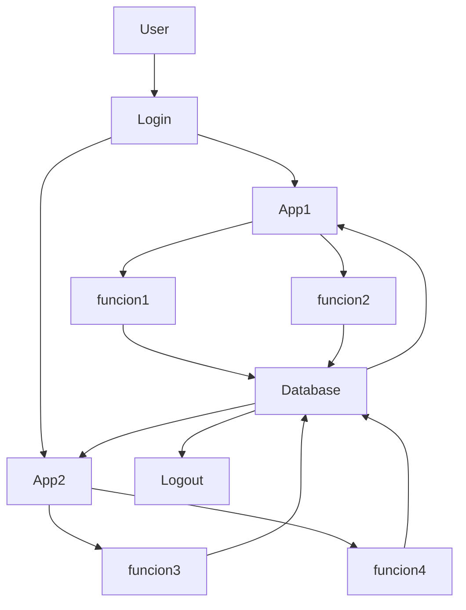

# **CEFAEMPRESA-ERP**

Esta es la introducción a un proyecto de software el cual es un ERP (Enterprise Resource Planning o Planificación de Recursos Empresariales),con el fin de que puedas comprender el porque y como se creo este proyecto.

El proyecto se a creado con el proposito de de soluciónas los problemas administrativos relaciónados a la gestion de información, ya que por el momento administran la información atraves de drive,wix, exel, docuementos fisicos.

Se le ofrece a los usuario una plataforma donde tengan sus credenciales, les permiten interactuar con el software con información persistente a largo plazo.

El software ofrece una serie de aplicaciónes que dentro tienen vistas las cuales ofrecen funciónes para administrar la información del software de manera controlada.

## **Proceso basico del software**

